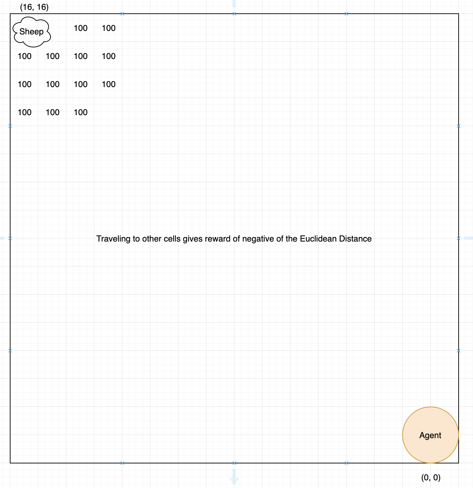
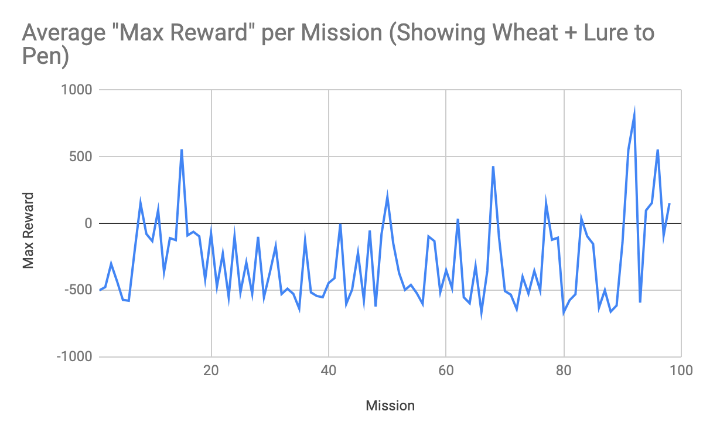
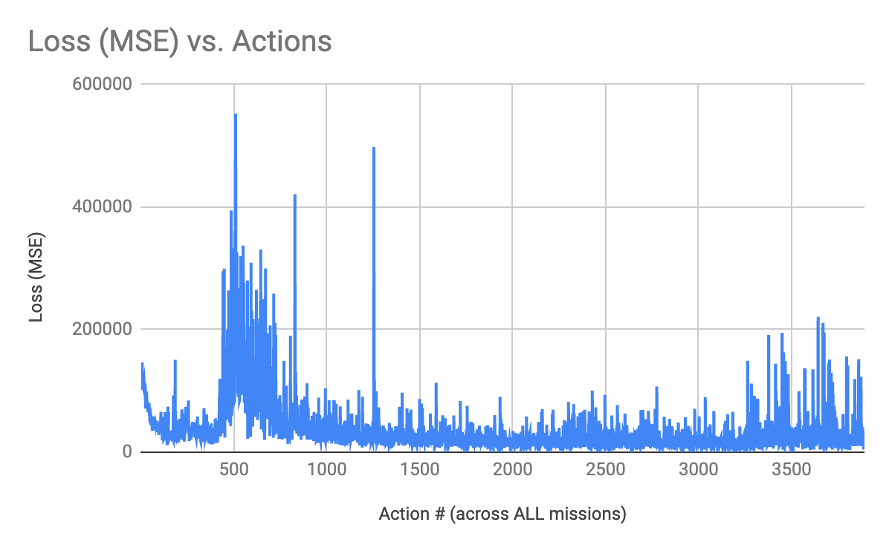

# PITA - Capture the Sheep! Final Report

## Video

<iframe width="560" height="315" src="https://www.youtube.com/embed/1bfdfoaMhI0" frameborder="0" allow="accelerometer; autoplay; encrypted-media; gyroscope; picture-in-picture" allowfullscreen></iframe>

## Summary

The main idea of the project is based on collecting and gathering wild animals (sheep) from the world and luring them into a pen. The agent will have no previous knowledge of the benefits/consequences of his actions in the world. During a set duration of time (20 seconds), the agent figure out how to get to sheep and to lure it back into a pen. Once the agent is able to lure the sheep back into the pen, the agent is teleported back to the start position and given a chance to lure other sheep from the world into the pen to increase its overall score.

The agent will have access to a detailed 2D grid of the world that specifies the location of each animal in it. The agent will choose an action to perform based on what it’s learned so far about the world. These actions include movement of the agent (North, South, East, West) or showing the wheat bundle in the agent’s inventory. It will receive positive reward for successfully reaching the sheep and negative reward for movement (steps taken). The negative reward increases as the distance of the agent from the sheep increases and decreases when the agent is closer to the sheep.

## Approach

We utilize deep Q-learning with neural networks in this project. Like any classical Q-learning problem, the agent will experiment and exploit past experiences (episodes) in order to maximize its reward. The gist is that the network will be used to predict an action the agent should take at a particular state, based on the action that maximizes the agent’s immediate and future reward at that state.

The use of deep Q-learning here is advantageous as it allows the agent to learn the best actions/policy to take in the environment based on a reward system, without needing to feed in training data like a supervised learning approach would require. However, a drawback with this approach is that the agent only learns to adapt to the particular world its placed in - it won’t immediately adapt to a completely different world layout without having to re-learn the best policy to take. This aside, reinforcement learning is still preferred here rather than direct supervised learning, or a hand-coded policy or traversal algorithm, as there are a huge number of states at play here in the sheep herding problem. Combining a neural network with reinforcement learning simplifies the overhead and allows more flexibility for the agent to learn on its own, rather than following some pre-defined algorithm.

Because the sheep in Minecraft can wander on its own, which is not predictable, there is a huge number of possible states in this environment. With a map size of 16 x 16 and multiple entities (agent and 2 sheep) on the map, we have 16777216 possible states and the 5 actions for each state. This is the key reason why we use deep Q-learning in this project, as a simpler reinforcement learning method like tabular Q-learning would not scale to this problem.

The reinforcement learning here is defined as a Markov Decision Process (MDP). It consists of an environment and agent. Our environment is defined as a grid world of a finite size (16 x 16 cells), enclosed by a fencing in Minecraft. Each cell is a Minecraft block. The agent can move to any of the cells on the world, and starts at the origin position of the world (0, 0). A sheep also starts at the opposite corner of this world, at cell (16, 16). The agent is given a wheat item in its inventory (holding wheat in Minecraft near sheep will lure the sheep near the holder), but the item is not selected at the start of a mission.

The agent is allowed to perform the following 5 actions in this environment:

- Move north
- Move south
- Move west
- Move east
- Show wheat from inventory (when the agent is holding wheat, it can lure sheep towards it when close enough)

The goal of the reinforcement learning algorithm is to “encourage” our agent to learn that its goal is to navigate towards the sheep, while also simultaneously learning that it must show the wheat in order to successfully lure the sheep. At the start of each mission (training session), the wheat item is NOT selected - the agent must learn to do this in addition to navigation.

Once the agent reaches the sheep, a predefined policy takes over to navigate the agent to a pen defined in the world, in which the sheep should be lured in to maximize the agent’s reward.
Although this particular policy is hardcoded, the agent still must learn that to maximize its reward, it must show the wheat before this predefined “return to pen” policy kicks in.

We define several rewards/penalties for the agent in its environment, which are computed after each action the agent takes. The reward values can range from negative values to positive values, of magnitude in the 100s.

- Negative of the Euclidean distance that the agent is from the sheep (negatively affects the reward - so when an agent is farther from the sheep, this reduces the reward)
- Negative of the Euclidean distance that the sheep is from the pen (negatively affects the reward, as the above one does)
- If the agent is within a distance of 4 a sheep, then reward the agent with +100 reward (one time reward for making it a sheep)
- If a sheep makes it to the pen (lured by the agent), then reward the agent with +500 reward
  - Also reward the agent with +100 reward when it’s close to the pen
- If the agent chooses to show the wheat, give them at +50 reward as encouragement to do so in future episodes. However, if the agent keeps choosing the wheat in succession, (i.e. previous action was also show wheat), then the agent will be penalized -200 to discourage wasting actions on that.

(Figure 1. Visualization of Neural Network)

For our neural network, the 256 nodes comes from our 16x16 pen space, there are 16\*16 = 256 cells accessible to the agent.

The keras deep learning library is configured to use 4 input layers in a neural network, with the reinforcement learning helping tweak the neural network so we develop an optimal decision policy.

We feed in the state of the world as a flattened input vector of the Malmo Minecraft grid, marking locations of agent and sheep. The network then outputs Q-values for the possible actions the agent can take at that state. We take the action with the highest Q-value and return that action to the agent. When training begins, deep q-learning policy is used with an exploration factor of 0.25 in order to incorporate some amount of randomness to the policy which can help the agent discover more optimal actions As agent experiences more and more iterations, the deep q-network gets better, which will allow the agent to score higher rewards. Every episode where the agent ends up with a positive rewards is considered a win. When the deep q-network reaches a win percentage of over 80% over a window of 50 episodes, we reduce Epsilon, the exploration factor to 0.1.

The overall learning algorithm used is thus as follows. It’s based off of taking actions that lead to agent episodes/experiences, which are stored and fed into a neural network model for training:

- Select an action a - with 25% probability random, 75% probability being policy-based
- Execute action a in the Malmo environment.
- Calculate the reward for that action.
- Store the episode (experience), which consists of the previous state, action, reward, and next state (resulting from the just taken action) into the model.
- Update the neural network (using the Adam algorithm, a variant of stochastic gradient descent) weights using the episodes stored in the model.
  - We update the Q-value for a particular state, action pair by using a Bellman equation:
    - Reward + discount \* [Max Q value from next state]
    - We use a discount of 0.95 in this model

## Evaluation

(Figure 2. Grid and Example Calculations for Reward per Cell)

This diagram shows a basic outline of the reward received when the agent moves to certain cells. The agent begins at (0, 0) and each movement to a cell gives a reward of the negative of the Euclidean Distance from the agent’s location to a sheep. Any cell within 4 of the sheep gives +100 reward and successfully luring the sheep back to the pen gives +500 reward.

We set up the evaluation for qualitative results to concern agent rewards.
The following histogram shows the average max reward per mission for the agent learning to show the wheat (make it the active, held item in his inventory)

(Figure 3. Average Max Reward per Mission (Agent learns to show wheat, 1 sheep only))

(Figure 4. Average Max Reward per Mission (Agent learns to show wheat & lure 1 sheep to pen))

This histogram shows the average max reward per mission for the agent learning to show the wheat and lure a single sheep back to the pen. This graph demonstrates that negative maximum reward is more common when the agent has to learn to show the wheat and lure the sheep back to the pen. The negativeness can be attributed to the increased complexity. The agent is able to get excellent positive rewards (successes) in several stretches, but overall it seems to shift between various local optima, as the max reward per mission is a bit erratic - this can possibly be explained by the complexity of the MDP, as there are a ton of states stemming from not only the possible agent actions, but also the non-deterministic movement nature of Minecraft sheep.

The next step of our project was to add additional sheep into the agent’s world, and train again and assess performance.

(Figure 5. Max Reward per Mission, with Multiple Sheep)
Figure 5 shows the max reward obtained in each mission for all of the mission/training iterations when adding in multiple sheep to the world. It can be seen in Figure 5 that the agent was unable to truly find a global optimal policy, even though it had some stretches where it obtained large positive rewards.

(Figure 6. Loss (MSE) vs. Actions Across All Missions)
Figure 6 shows the loss over time as the agent is trained, across all of the missions. Loss is measured as mean squared error. It can be seen that the agent does learn to some degree - as the general trend seem in the graph is that the loss decreases, though there is a range near the end where the loss seems to rise again - this is again possibly due to the huge number of possible states leading to unfamiliar situations to the agent, and thus an inability to find a global optima.

Overall, our agent did not perform that well when increasing the number of sheep in the world. We believe that this is due to the several following factors. The first one is the configuration of our reward function. We believe that we should add in some extra reward for an agent getting the sheep to sense it’s wheat. As you can see in the graphs, an agent learning to show the wheat from his inventory is the most effective policy to getting a higher reward. The second factor is the depth of our neural network. We believe that adding more hidden layers and changing the shape of each layer could improve the efficacy of our AI algorithm; however, we lacked the expertise in deep learning and the necessary computing power to train such an extensive deep neural network. Lastly, our exploration factor may have been too high. Setting epsilon to 0.25 means that 1 in 4 actions are random. This could make it take longer for our agent to reach an optimal policy because of the amount of randomness that we’ve introduced. A final factor is the sheer number of possible states - with multiple sheep being able to move randomly, every mission run in the world isn’t identical to the rest, amplifying the challenge of the agent to adapt to ever so slightly changing world states due to the sheep movement.

We were able to specifically account for the “remaining goals and challenges” from our status report and left ample time to train our agent. However, the results were not as expected for the reasons mentioned above.

## Conclusion

Overall, we learned a lot about AI/ML algorithms, implementation, libraries, and applications. I think the biggest thing that we all realized by the end of this quarter was that not every problem should be solved by machine learning, rather, it is a specific tool for very specific types of problems. Furthermore, we learned the difficulties of implementing an algorithm into another piece of software, which included setting up the environment, standardizing the data, and connecting the algorithm to the agent. All of this is non-trivial work that had to be done in order to make the entire project run. Last, but not least, we learned a lot about the world of reinforcement learning and how agents can learn from their previous experiences in order to perform better. This class has taught us a lot about using machine learning in conjunction with real software and both the challenges and benefits that machine learning can bring.

## Resources Used

- [Rat Maze Deep RL](https://www.samyzaf.com/ML/rl/qmaze.html)
- [Deep Q Learning with Keras](https://keon.io/deep-q-learning/)
- [Simple Reinforcement Learning with Tensorflow](https://medium.com/emergent-future/simple-reinforcement-learning-with-tensorflow-part-0-q-learning-with-tables-and-neural-networks-d195264329d0)
- [Python Malmo Tutorials](https://github.com/Microsoft/malmo/tree/master/Malmo/samples/Python_examples)
