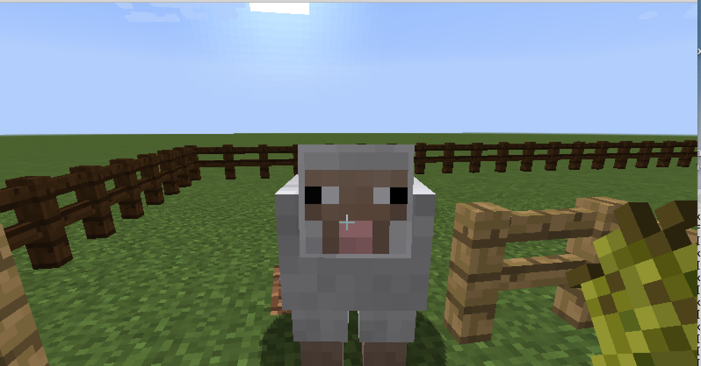

Source code: https://github.com/mrdanshih/peta

## Reinforcement Learning in Minecraft with Malmo ###

 

An AI for sheep herding. We apply reinforcement learning techniques to train an agent to lure sheep into a pen, within the Minecraft Malmo artifical intelligence platform.

## Repository
https://github.com/mrdanshih/peta/