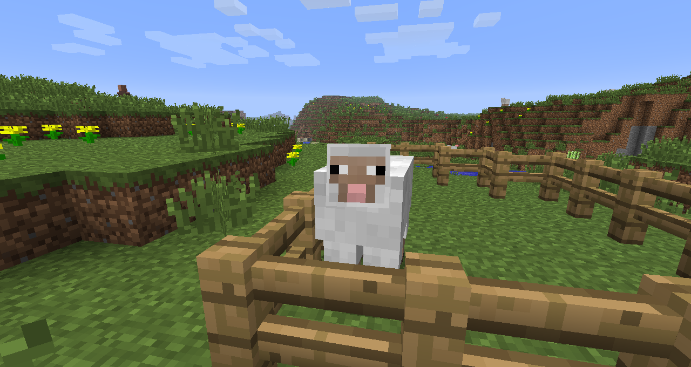

## Reinforcement Learning in Minecraft with Malmo ###

 
                                       
An AI for sheep herding. We apply reinforcement learning techniques to train an agent to lure sheep into a pen, within the Minecraft Malmo artifical intelligence platform.

## Repository
https://github.com/mrdanshih/peta/

## Resources
* Rat Maze Deep RL:  https://www.samyzaf.com/ML/rl/qmaze.html
* Deep Q Learning with Keras:	https://keon.io/deep-q-learning/
* Simple Reinforcement Learning with Tensorflow: https://medium.com/emergent-future/simple-reinforcement-learning-with-tensorflow-part-0-q-learning-with-tables-and-neural-networks-d195264329d0
* Malmo: https://github.com/microsoft/malmo
