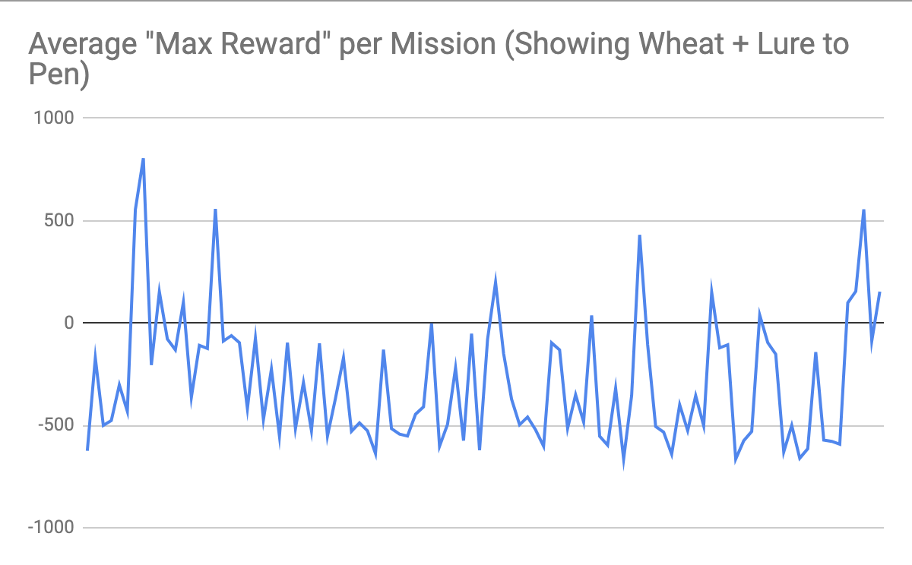

# PITA - Capture the Sheep!

## Project Status

### Summary

The main idea of the project is based on collecting and gathering wild animals (sheep) from the world and luring them into a pen. The agent will have no previous knowledge of the benefits/consequences of his actions in the world. During a set duration of time (20 seconds), the agent figure out how to get to sheep and to lure it back into a pen.

The agent will have access to a detailed 2D grid of the world that specifies the location of each animal in it. The agent will choose an action to perform, either moving north, west, east, or south, based on what it’s learned so far about the world. It will receive positive reward for successfully reaching the sheep and negative reward for movement (steps taken). The negative reward increases as the distance of the agent from the sheep increases and decreases when the agent is closer to the sheep.

### Approach

Because the sheep in Minecraft can wander on its own, which is not predictable, there is a huge number of possible states in this environment. With a map size of 16 x 16 and 2 entities (agent, sheep) on the map, we have 2^256 possible states and the 5 actions for each state. This is the key reason why we use deep Q-learning in this project, as a simpler reinforcement learning method like tabular Q-learning would not scale to this problem.

The reinforcement learning here is defined as a Markov Decision Process (MDP). It consists of an environment and agent. Our environment is defined as a grid world of a finite size (16 x 16 cells), enclosed by a fencing in Minecraft. Each cell is a Minecraft block. The agent can move to any of the cells on the world, and starts at the origin position of the world (0, 0). A sheep also starts at the opposite corner of this world, at cell (16, 16). The agent is given a wheat item in its inventory (holding wheat in Minecraft near sheep will lure the sheep near the holder), but the item is not selected at the start of a mission.

The agent is allowed to perform the following 5 actions in this environment:

- Move north
- Move south
- Move west
- Move east
- Show wheat from inventory (when the agent is holding wheat, it can lure sheep towards it when close enough)

The goal of the reinforcement learning is to “encourage” our agent to learn that its goal is to navigate towards the sheep, while also simultaneously learning that it must show the wheat in order to successfully lure the sheep. At the start of each mission (training session), the wheat item is NOT selected - the agent must learn to do this in addition to navigation.

Once the agent reaches the sheep, a predefined policy takes over to navigate the agent to a pen defined in the world, in which the sheep should be lured in to maximize the agent’s reward.
Although this particular policy is hardcoded, the agent still must learn that to maximize its reward, it must show the wheat before this predefined “return to pen” policy kicks in.

- We define several rewards/penalty for the agent in its environment, which are computed after each action the agent takes. The reward values can range from negative values to positive values, of magnitude in the 100s.
- Negative of the Euclidean distance that the agent is from the sheep (negatively affects the reward - so when an agent is farther from the sheep, this reduces the reward)
- Negative of the Euclidean distance that the sheep is from the pen (negatively affects the reward, as the above one does)
- If the agent is within a distance of 4 to the sheep, then reward the agent with +100 reward (one time reward for making it to the sheep)
- If the sheep makes it to the pen (lured by the agent), then reward the agent with +500 reward
  -- Also reward the agent with +100 reward when it’s close to the pen
- If the agent chooses to show the wheat, give them at +50 reward as encouragement to do so in future episodes. However, if the agent keeps choosing the wheat in succession, (i.e. previous action was also show wheat), then the agent will be penalized -200 to discourage wasting actions on that.

Figure 1. Visualization of Neural Network

For our neural network, the 256 nodes comes from our 16x16 pen space, there are 16\*16 = 256 cells accessible to the agent.

The keras deep learning library is configured to use 4 input layers in a neural network, with the reinforcement learning helping tweak the neural network so we develop an optimal decision policy.

When training begins, a random policy is used, but as more iterations of training occur, the neural network learns a better policy based on the rewards defined for each action above. We feed in the state of the world as a flattened input vector of the Malmo Minecraft grid, marking locations of agent and sheep. The network then outputs Q-values for the possible actions the agent can take at that state.

As in many Q-learning scenarios, we have the agent occasionally take a random action in order to explore the environment more and acquire new experiences. This allows it to possible find new action sequences that can lead to larger rewards. We configure this to occur about 10% of the time, where in the other 90% of actions the agent uses the neural network’s learned policy to choose an action.

The overall learning algorithm used is thus as follows. It’s based off of taking actions that lead to agent episodes/experiences, which are stored and fed into a neural network model for training:

- Select an action a - with 10% probability random, 90% probability being policy-based
- Execute action a in the Malmo environment.
- Calculate the reward for that action.
- Store the episode (experience), which consists of the previous state, action, reward, and next state (resulting from the just taken action) into the model.
- Update the neural network (using the Adam algorithm, a variant of stochastic gradient descent) weights using the episodes stored in the model.
  -- We update the Q-value for a particular state, action pair by using a Bellman equation:
  --- Reward + discount \* [Max Q value from next state]
  --- We use a discount of 0.95 in this model

### Evaluation

Currently, the agent is score is determined based on his ability to lure the sheep back into the pen. We label an episode as a "win" if the agent's final score is above 0 and a loss if the agent's final score is below 0. For the Deep Q Network, we use Mean Square Error between the actual Q-Value and the predicted Q-Value to evaluate our agent’s performance.

Below are some graphs showing the agent's score over time.

### Remaining Goals and Challenges

# Goals

Right now, our agent gets pretty good at luring one sheep back to the pen. In the following weeks, our goal is to expand the agent’s ability to luring multiple sheep in the same episode in order to achieve a higher reward. We would also like to train our agent with more episodes so that the agent can get a better average win rate and a better average final score. Lastly, we would want to expand our world slightly so that the sheep are able to spread out. This way, we can truly evaluate the agent’s ability to navigate to the sheep and lure them back to the pen.

# Challenges

A major challenge that we anticipate is the long training time of our deep Q network. Given that each episode is 20 seconds, running 1000 episodes will take over 5 hours of training time. We need to be mindful of this training time and give ourselves enough buffer time before the final report is due in order to train the agent. We also need to make sure that we are saving the weights of our neural network so that we don’t start from scratch every time we make a change.
